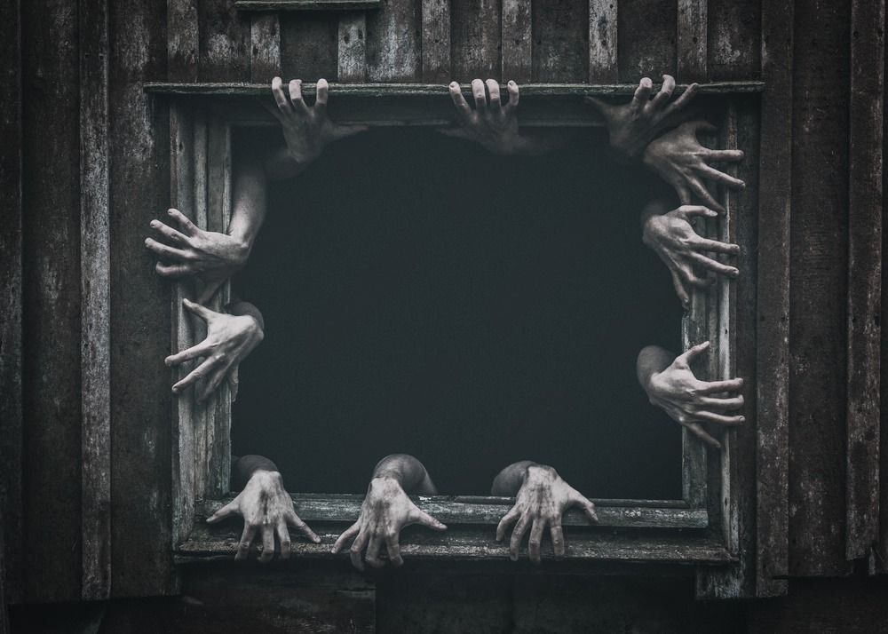

# Sussurros da Meia-Noite 🌃



> Uma landing page imersiva com temática de terror, dedicada aos amantes do gênero. Explore listas selecionadas dos melhores filmes, séries e livros que vão te deixar acordado à noite.

## 📜 Sobre o Projeto

Este projeto foi criado como uma forma de praticar e demonstrar habilidades em desenvolvimento front-end (HTML, CSS e um pouco de JavaScript simples), aplicando conceitos de design responsivo, animações e boas práticas de código para criar 
uma experiência de usuário envolvente e atmosférica.

---

## ✨ Funcionalidades

*   **Design Temático:** Interface sombria e fontes que criam uma atmosfera de terror.
*   **Conteúdo Selecionado:** Listas "Top 3" de filmes, séries e livros do gênero.
*   **Animações Sutis:** Efeitos de fade, glitch e hover para uma experiência mais dinâmica.
*   **Totalmente Responsivo:** O layout se adapta perfeitamente a desktops, tablets e smartphones.
*   **Navegação Suave:** Rolagem suave entre as seções para uma navegação fluida.

---

## 🛠️ Tecnologias Utilizadas

Este projeto foi construído com as seguintes tecnologias:

*   **HTML5:** Para a estrutura e semântica do conteúdo.
*   **CSS3:** Para estilização, layout (Flexbox, Grid) e animações.
*   **JavaScript (Vanilla):** Para interatividade e manipulação do DOM.
*   **Git e GitHub:** Para versionamento de código e hospedagem.

---

## 🚀 Como Executar o Projeto

Para visualizar o projeto localmente, siga os passos abaixo:

1.  **Clone o repositório:**
    ```bash
    git clone https://github.com/vitorf2003/sussurros-da-meia-noite.git
    ```

2.  **Navegue até a pasta do projeto:**
    ```bash
    cd sussurros-da-meia-noite
    ```

3.  **Abra o arquivo `index.html` no seu navegador de preferência.**

E pronto! Você já pode explorar o site.

---

## ✒️ Autor

Feito com ❤️ e alguns sustos por **Vitor Faria**.

*   **LinkedIn:** [Vitor Faria](https://www.linkedin.com/in/vitor-faria-3865321b5)
*   **GitHub:** [@vitorf2003](https://github.com/vitorf2003)

